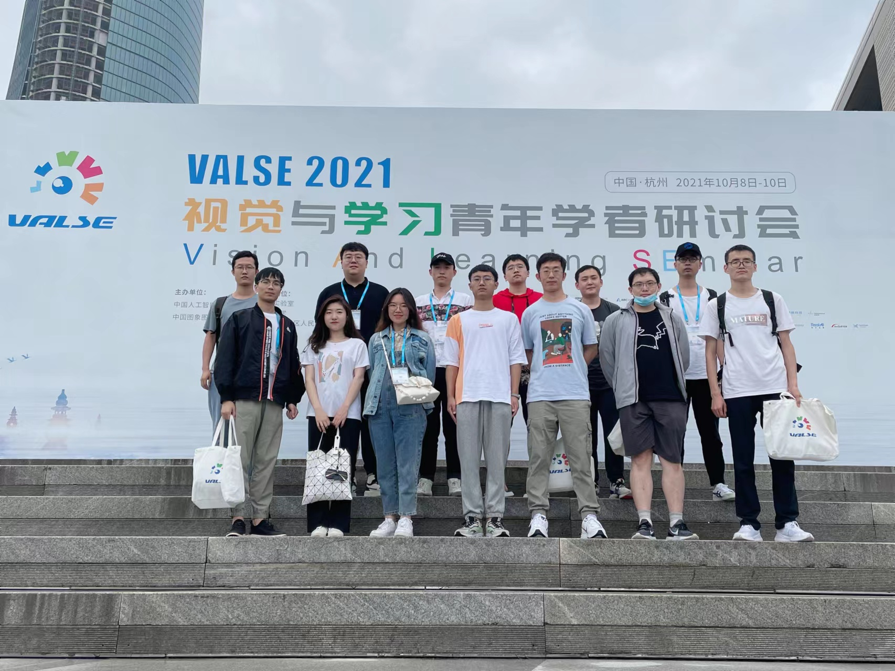

We attended VALSE 2021, which is a broad platform for young AI researchers in china held in HangZhou. It targets to enhance the cooperation and communication between AI researchers as well as motivates some insightful ideas. VALSE 2021 lasts three days and holds tens of meeting for broadcasting the up-to-date advance in computer vision and machine learning.

In the first day, VALSE 2021 held the opening ceremony and briefly introduced its past history. In the past two and a half days, VALSE 2021 held a number of parallel venues including some interesting topics such as video understanding, self-attention mechanism and GAN, which we attended separately. 

Finally, we take a phoho for our groups.

