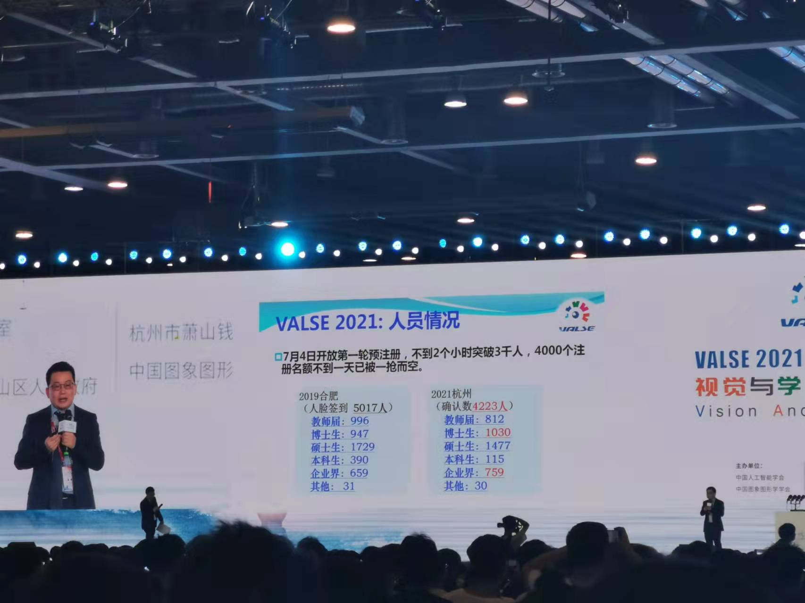

We attended VALSE 2021, which is a broad platform for young AI researchers in china held in HangZhou. It targets to enhance the cooperation and communication between AI researchers as well as motivates some insightful ideas. VALSE 2021 lasts three days and holds tens of meeting for broadcasting the up-to-date advance in computer vision and machine learning.

